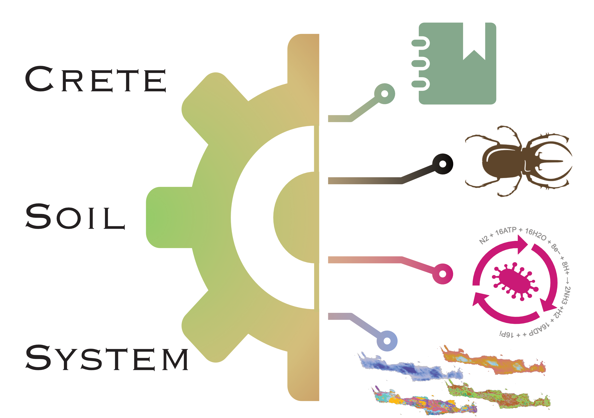

# Crete data integration

This repository aims to bring together biodiversity knowledge regarding 
the island of Crete, Greece. Crete has been studied extensively for more 
than three centures. This has resulted in a wealth of knownledge available 
in the forms of :

* literature (contemporary - PubMed, Google Scholar, Dimensions and historical - Biodiversity Heriatage Library),

* species occurrences and metadata in public databases (GBIF, IUCN)

* environmental data from remote sensing and spatial data (e.g Copernicus, ESDAC, WorldClim)

* sequences from environmental DNA studies (e.g ENA, Mgnify)

More specificaly, the focus is on the soil ecosystems of Crete.
Soils are consindered the cornerstones of terrestrial functioning.
Biodiversity interactions are between all domains of life which form
multilevel associations. Bacteria, archaea, unicellular eukaryotes, nematodes,
earthworms, arthropods, molluscs, plants, mammals; all occur in unison and 
influence the ecosystems they inhabit with their abundance, biomass and metabolism.
The plant-insect-soil ecosystem is starting to be studied as a whole to discover
important associations with practical implications such as plant resistance 
to insect attack.

The integration of biodiversity knowledge in one place is a longstanding
goal in ecological research. The synthesis of multiple data types and datasets across the globe has enabled 
holistic approaches to crutial scientific and sociatal questions.

Based on the consept of data representation of ecosystems 

## BHL

Historical literature of Crete's biodiversity.

```
wget http://www.biodiversitylibrary.org/data/data.zip
```
From the schema and the BHL data model we perform searches on Title, Items and Subjects. Items are the bound objects of BHL, so a title can have multiple items. The digitised document is the item. Additionaly, each title is assigned with subjects. The are not standardised. Each Item also has a pages table with information per page.

In the BHL schema it is noted that :

NOTE: This export DOES NOT include all of the pages in the BHL database. It only contains pages on which taxonomic names have been identified.

There is an archive from BHL that contains all OCR text [here](https://smithsonian.figshare.com/articles/dataset/BHL_Optical_Character_Recognition_OCR_-_Full_Text_Export_new_/21422193/12).
It is about 40gb tarball.

## Pubmed

Keep the PMIDs of the articles that mention crete

```
date; gunzip -c ../pubmed2023/*.tsv.gz | ./scripts/search_engine.awk keywords_crete.txt - > crete_pubmed_results.tsv ; date 
```
then keep only the PMIDs of Crete

```
gunzip -c ../pubmed2023/*.tsv.gz \ 
    | gawk -F"\t" -v OFS="\t" '(FNR==NR){id[$2]=1; next}{gsub("\\|.*$","",$1); if ($1 in id){print}}' crete_pubmed_results.tsv - > crete_pubmed_all.tsv
```
The OFS ensures the output is tab-separated after gsub.

Sanity check that all abstracts are returned

```
gawk -F"\t" '(FNR==NR){found[$1]=1; next}(!($2 in found)){print $2}' crete_pubmed_all.tsv crete_pubmed_results.tsv
```

This abstract retrieval results in 1556 unique abstracts. The name of Crete is distinct and there are few false 
positives. These abstracts were manually curated because most of them are biomedical.
From these, 170 abstracts are from environmental sciences.

## GBIF

> GBIF.org (17 January 2023) GBIF Occurrence Download  https://doi.org/10.15468/dl.xphruk

The `occurrence.txt` has 259 fields. 

```
head -1 occurrence.txt | gawk -F"\t" '{for (i=1;i<=NF;i++){print i FS $i}}' 
```

Summery of occurrences per kingdom
```
gawk -F"\t" '(NR>1){a[$197]++}END{for (i in a){print i FS a[i]}}' occurrence.txt
Protozoa        483
Chromista       12984
Plantae 50763
Archaea 35
Animalia        93692
Bacteria        2189
incertae sedis  871
Fungi   11675
```

## JGI GOLD

Download all the metadata of the GOLD database from [here](https://gold.jgi.doe.gov/downloads). 
Select the `Public Studies/Biosamples/SPs/APs/Organisms Excel` option.

## IUCN RedList

More than 650 assessments of species that occur in Crete are available in IUCN Red Lists. 
The download was two-fold, one for species data and one for species spatial occurrences.

## EUROPEAN SOIL DATA CENTRE (ESDAC)

ESDAC hosts the European soil database which contains information about soils across
Europe from satelite data as well as sampling data. More specificaly, Land Use and Cover 
Survey (LUCAS) has valuable point data and soil physical/ chemical properties. This 
top soil sampling has also reached Crete.

## Copernicus Land Monitoring Service

Copernicus contains multiple remore sensing data that for example categorise the 
ecotypes of Crete.

## Environmental sequencing samples

ENA database has an API functionality to search with geographic boundaries. 

Using this method with a POST request we build the following querry:

```
curl -X POST -H "Content-Type: application/x-www-form-urlencoded" -d 'result=sample&query=geo_box1(34.6580,23.1572,35.8195,26.8076)&fields=all&limit=0&format=tsv' "https://www.ebi.ac.uk/ena/portal/api/search" > ena_post_crete.tsv
```

To get all the sample attributes:

```
./scripts/get_ena_samples_attributes.py results/ena_post_crete.tsv ena_data_crete
```

To transform all xml attributes to tsv:
```
./scripts/ena_xml_to_csv.py ena_data_crete  results/ena_samples_attributes-crete.tsv
```

Island Sampling Day, a metagenome project, sampled top soil in 72 locations around Crete
in 2016 and 2022.


## Harmonized World Soil Database v2.0

This dataset (HW2) has two files that are complementary:
1. raster file with numerical values at 1 sp. km resolution
2. a mdb file (microsoft access database) with tables containing the attributes

Data can be downloaded from [here](https://www.fao.org/soils-portal/data-hub/soil-maps-and-databases/harmonized-world-soil-database-v20/en/)

The mdb file can be handled without Microsof Access through the MDB Tools.
[MDB tools](https://github.com/mdbtools/mdbtools) is a set of programs to help you extract data from Microsoft Access files in various settings. 

## World Soil Information service
Download the latest data from the ISRIC and [WoSIS](https://www.isric.org/explore/wosis) soil spatial service
from the Open Geospatial Consortium (OGC). The data are availoable from the 
Web Feature Service (WFS). The script `get_wosis_crete.R` retrieves the locations 
of soil samples in Crete. 


## HILDA+
Global land use change hildap_GLOB-v1.0 is a great dataset that combines historical 
and conteporary data to estimate the yearly changes of land use. 


